# Setup a Static Website Using Nginx

Luanching my own static website

### Create An Ubuntu Server

- Locate and click the **EC2** within the AWS management console

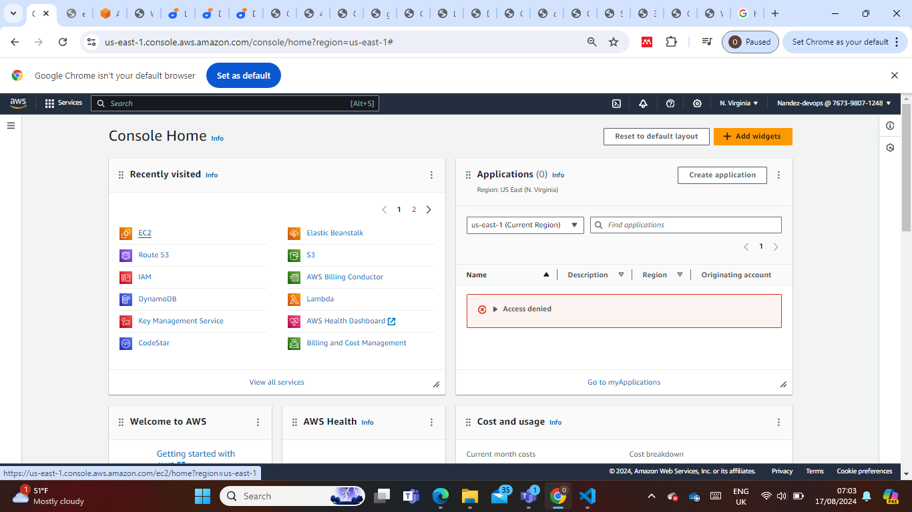

- Click on ** Launch Instance**

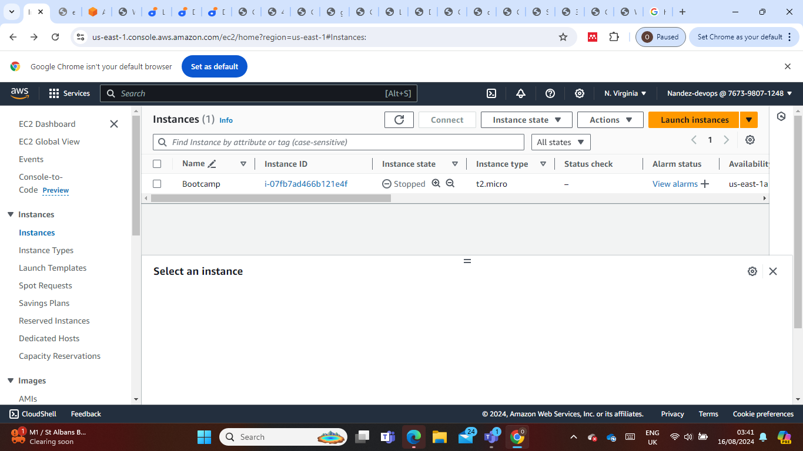

**Name** your instance and select **Ubuntu** AMI

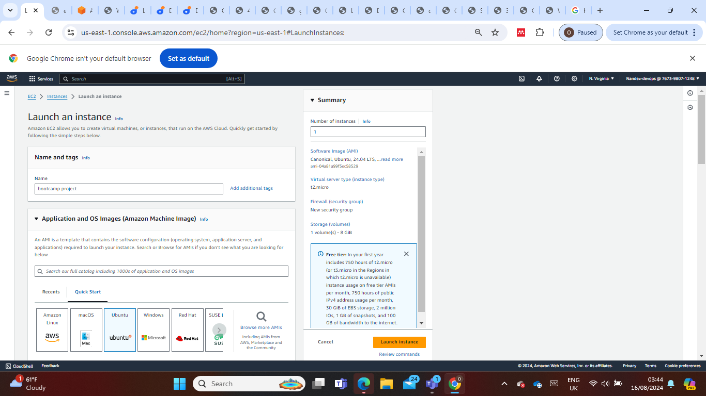

- Click the **Create new key pair** button to generate a key pair for secure connection to your instance or choose an already existing. 
- Then enable **SSH**, **HTTP**, **HTTPS**
- Click on **Launch Instance** to launch your instance

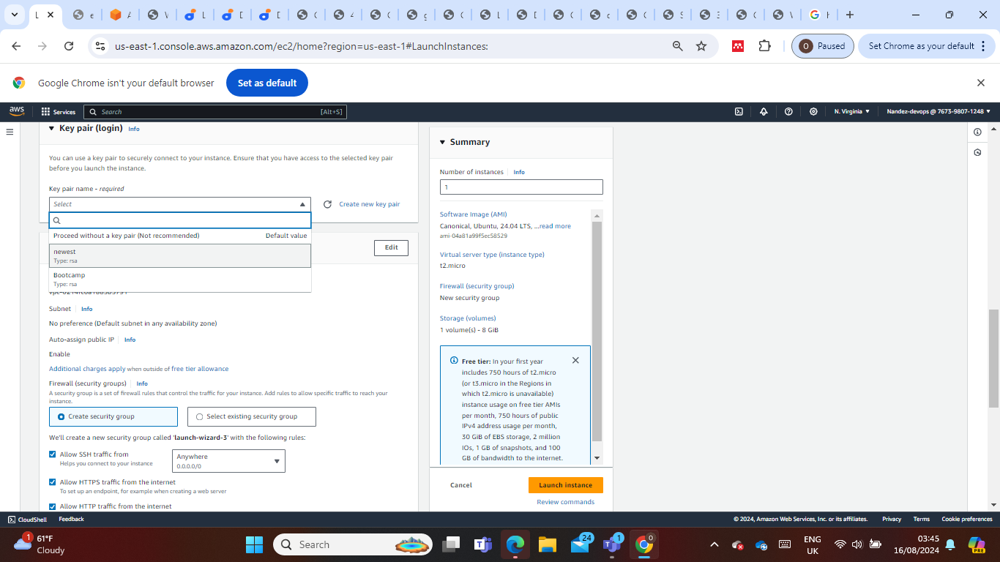

> [!NOTE]
For security reasons, it's recommended to restrict SSH access to your IP address only. However, for the purpose of this documentation, access has been granted from anywhere.

- Click on the instance created and copy the **Public IPv4 DNS**

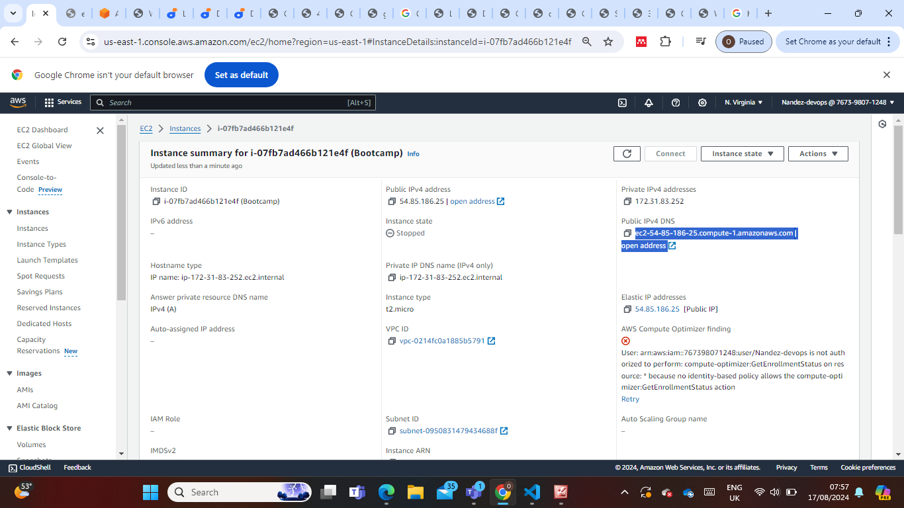

- Get to you **CLI Terminal** of choice and navigate to your folder where you saved the **Key pair**. 
- Ssh into your EC2 instance with this command `ssh -i "newest.pem" ubuntu@ec2-54-85-186-25.compute-1.amazonaws.com`

> [!Note;] That is inserting your **Key pair** and **Public IpV4 DNS**

# Create And Assign an Elastic IP

- Return to your AWS console an the **menu icon** to open the dashboard menu.
- Select **Elastic IPs** under **Network and Security**.
- Click on the  **Allocate Elastic IP address** button.

- Keep the settings unchanged and proceed to click **Allocate**.

- **Associate this Elastic IP address** with your running instance.

- Select the instance you wish to associate with the elastic IP address, then click on **Associate**.

> [!NOTE]
The IP address for your instance has been updated to the elastic IP associated with it. Therefore, you will need to SSH into your instance again. Return to the connection page of your instance and copy the new command.

- Paste the **command** into your terminal and then press Enter. When prompted, type **"yes"** and press Enter to connect.

---

### Install Nginx and Setup Your Website

- Execute the following commands.

`sudo apt update`

`sudo apt upgrade`

`sudo apt install nginx`

- Start your Nginx server by running the **`sudo systemctl start nginx`** command, enable it to start on boot by executing **`sudo systemctl enable nginx`**, and then confirm if it's running with the **`sudo systemctl status nginx`** command.

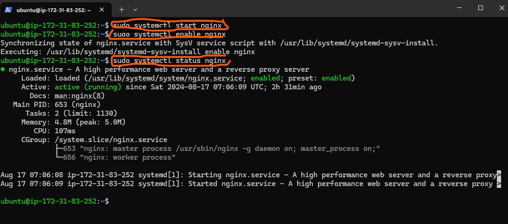

- Go back to your EC2 dashboard and copy your **Public IPv4 address**.

- Visit your instances **Public IPv4 address** in a web browser to view the default Nginx startup page.

- Download your website template from your preferred website by navigating to the website, locating the template you want, and obtaining the download URL for the website.

---

## How to obtain the website template URL from tooplate.com:

- Visit [**Tooplate**](https://www.tooplate.com/) and select the website template you prefer.

- Scroll down to the download section, right-click to open the menu, and select **Inspect** from the options.

- Select the **Network** tab.

- Click the **Download** button.

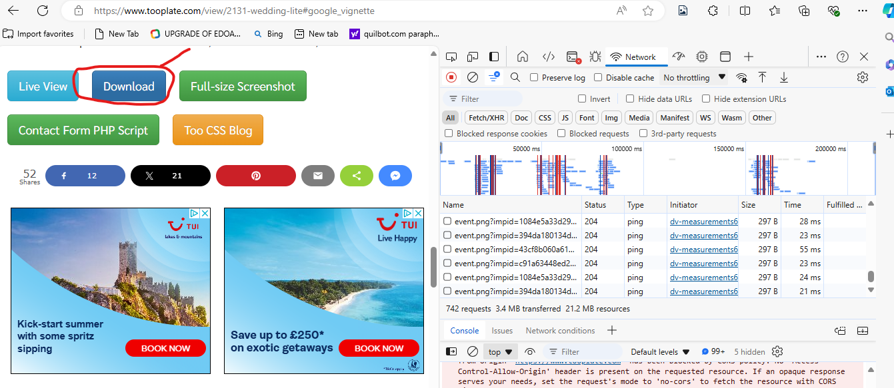

- You’ll see the **website zip folder** appear. Hover your mouse or trackpad pointer over it and right-click again.

> [!NOTE]
Make sure you right-click on the zip folder, the one that says **.zip**. If it doesn't appear after clicking download, try clicking the download button again until it shows up, as shown in the picture.

- Hover your mouse cursor over **Copy①** and then click on **Copy URL②** from the list that appears on the right.

- paste the URL into a notepad to use alongside the **`curl`** command when downloading the website content to your machine.

---

- Run this command **`sudo curl -o /var/www/html/2131_wedding_lite.zip https://www.tooplate.com/zip-templates/2132_wedding_lite.zip`** to download the websites file to your html directory.

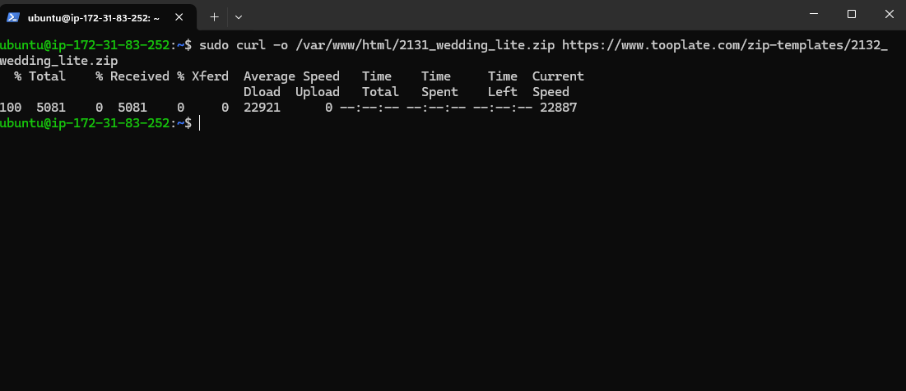

> [!Note]
The curl command is a utility for making HTTP requests via the command line. Here, it's utilized to retrieve a file from a specified URL. The -o flag designates the output file or destination. In this instance, it signifies that the downloaded file, named "2131_wedding_lite.zip", should be stored in the "/var/www/html/" directory. The URL https://www.tooplate.com/zip-templates/2131_wedding_lite.zip is the source for downloading the file.

- To install the unzip tool, run the following command: sudo apt install unzip.

- Navigate to the web server directory by running the following command: `cd /var/www/html`.

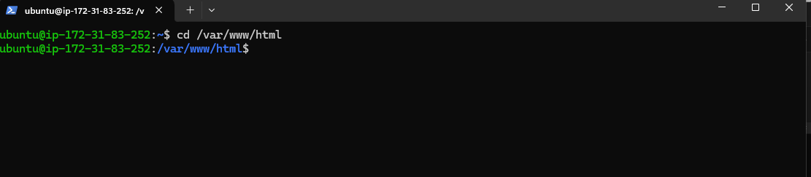

- Unzip the contents of your website by running sudo unzip <website template name>.

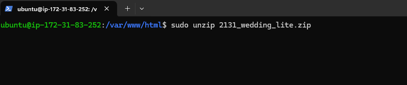

> [!Note]
Replace <website template name> with the actual name of your website zip file. For example, mine is 2131_wedding_lite.zip so i ran `sudo unzip 2131_wedding_lite.zip`.

- Update your nginx configuration by running the command `sudo nano /etc/nginx/sites-available/default`. Then, edit the root directive within your server block to point to the directory where your downloaded website content is stored.

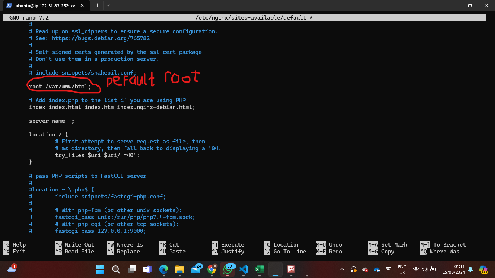

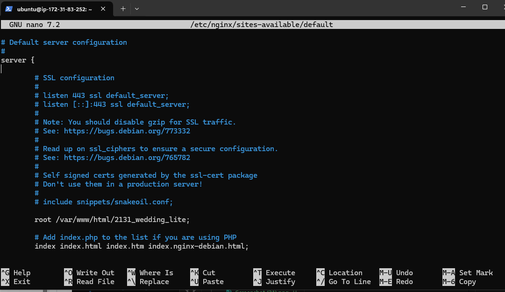

- Restart Nginx to apply the changes by running: `sudo systemctl restart nginx`.

- Open a web browser and go to your Public IPv4 address/Elastic IP address to confirm that your website is working as expected.

---

### Create An A Record

To make your website accessible via your domain name rather than the IP address, you'll need to set up a DNS record. I did this by buying my domain from godaddy and then moving hosting to AWS Route 53, where I set up an A record.

> [!NOTE]
Your domain registrar's interface might look different, but they all follow a similar basic layout.

- On the website click on **Domain List**.

- Click on the **Manage** button.

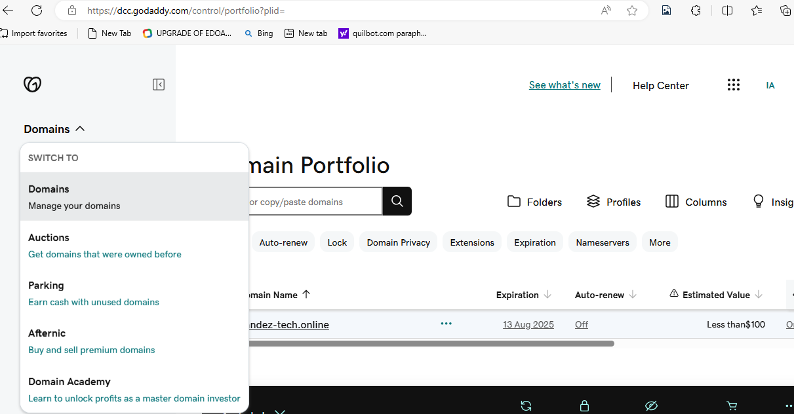

- Go back to your AWS console, search for **Route 53①**, and then choose **Route 53②** from the list of services shown.

- Click on **Get started**.

- Select **Create hosted zones①** and click on **Get started②**.

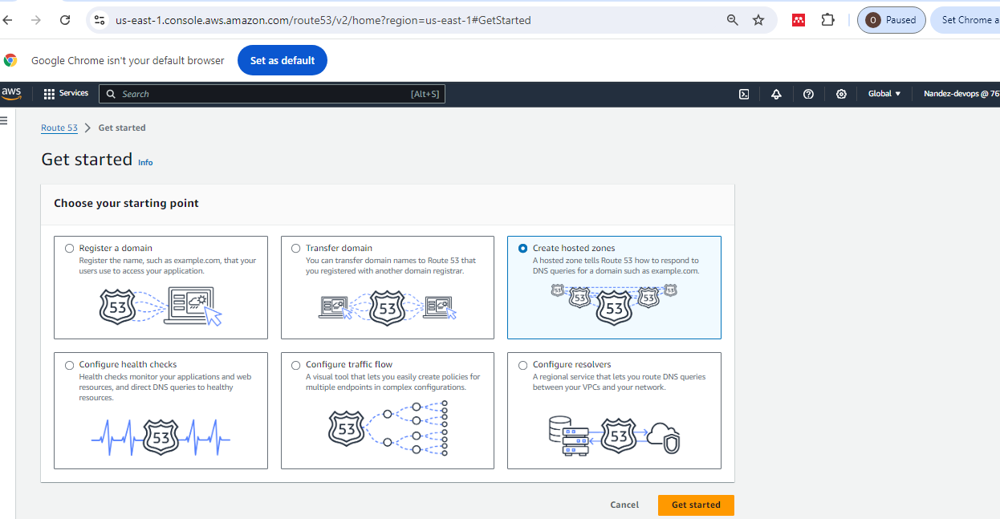

- Enter your **Domain name①**, choose **Public hosted zone②** and then click on **Create hosted zone③**.

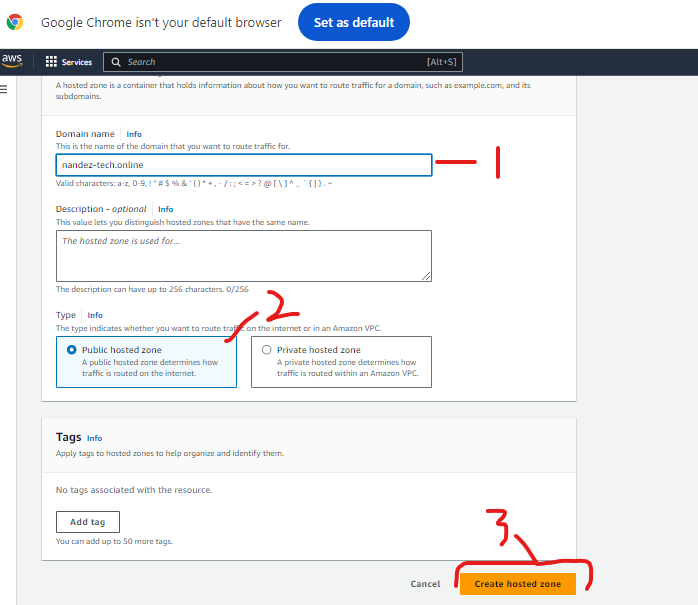

- Select the **created hosted zone①** and copy the assigned **Values②**.

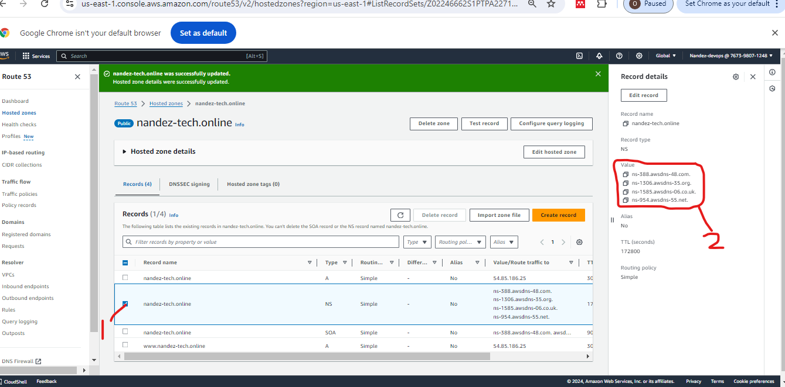

- Go back to your domain registrar and select **Custom DNS** within the **NAMESERVERS** section.

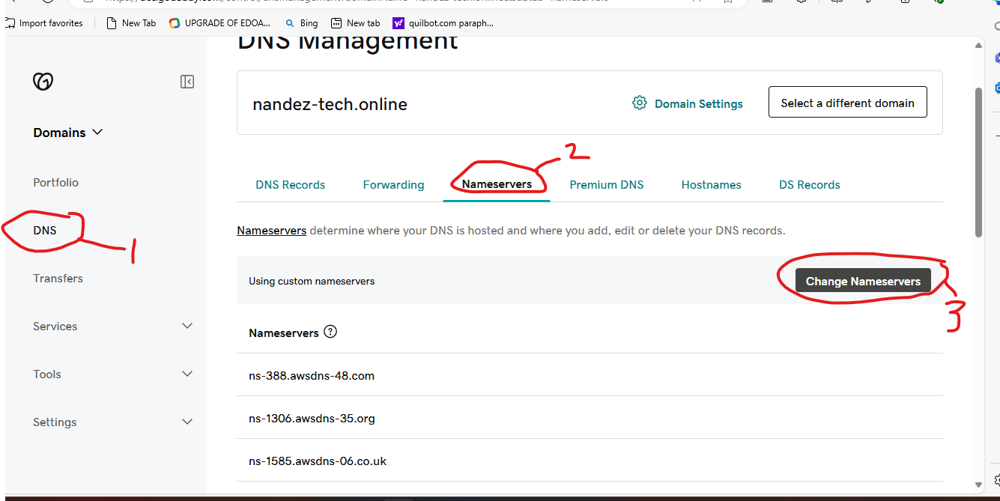

- Paste the values you copied from Route 53 into the appropriate fields, then click the **checkmark symbol** to save the changes.

- Head back to your AWS console and click on **Create record**.

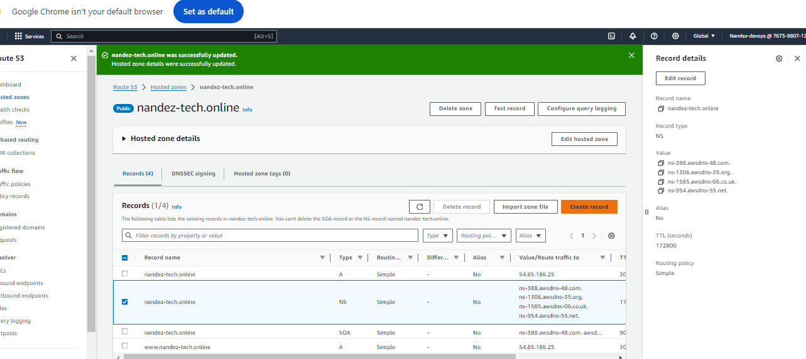

- Paste your Elastic IP address and then click on **Create records**.

- Your A record has been successfully created.

- Click on **create record** again, to create the record for your sub domain.

- Input the Record name(**www➀**), paste your **IP address➁**, and then click on **Create records➂**.

> [!NOTE]
Make sure to create DNS records for both your root domain and subdomain. This involves setting up an A record for the root domain (e.g., **`example.com`**) and another A record for the subdomain (e.g., **`www.example.com`**). These records will direct traffic to your server's IP address, ensuring that both your main site and any subdomains are accessible.

- Open your terminal and run **`sudo nano /etc/nginx/sites-available/default`** to edit your settings. Enter your domain and subdomain names, then save the changes.

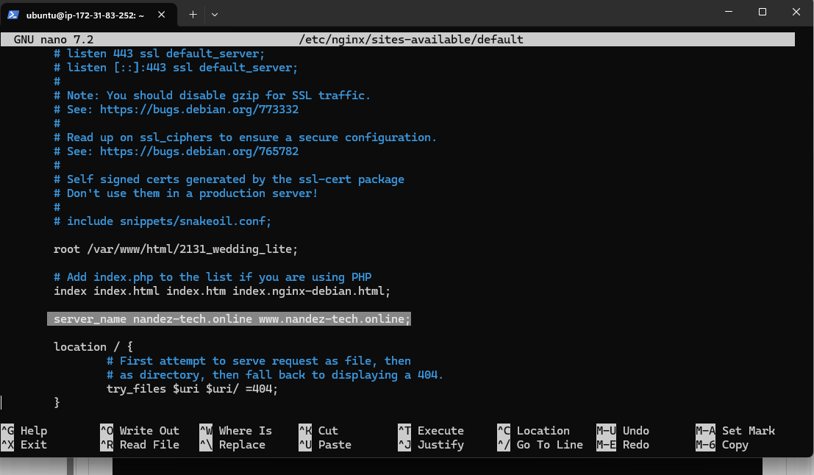

- Restart your nginx server by running the **`sudo systemctl restart nginx`** command.

- Go to your domain name in a web browser to verify that your website is accessible.

> [!NOTE]
You may notice the sign that says **Not secure**. Next, you'll use certbot to obtain the SSL certificate necessary to enable HTTPS on your site.

---

### Install certbot and Request For an SSL/TLS Certificate

- Install certbot by executing the following commands:
**`sudo apt update`**
**`sudo apt install certbot python3-certbot-nginx`**

- Execute the **`sudo certbot --nginx`** command to request your certificate. Follow the instructions provided by certbot and select the domain name for which you would like to activate HTTPS.

- Verify the website's SSL using the OpenSSL utility with the command: **`openssl s_client -connect jaykaneki.cloud:443`**

- Visit **`https://<domain name>`** to view your website.

---
---

#### The End Of Project 1